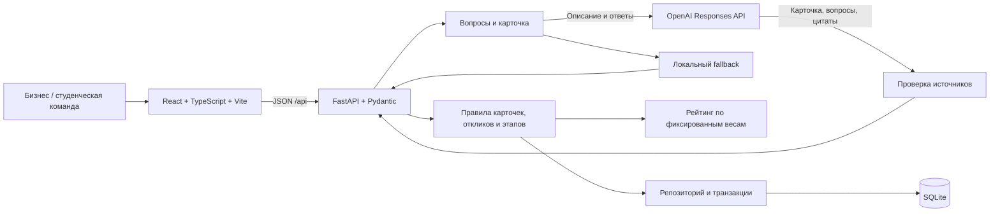

# Tubi — от задачи бизнеса к студенческому проекту

**Tubi помогает бизнесу сформулировать понятную задачу, а студентам — предложить решение и получить практический опыт.** Предприниматель описывает проблему своими словами. AI находит пробелы, задаёт вопросы и собирает карточку. Человек проверяет сведения, публикует задачу и самостоятельно выбирает команду.

MVP для 5-часового AI-хакатона · команда из 3 человек · веб-приложение для демонстрации на компьютере.

[Запустить проект](#быстрый-запуск) · [Что делает AI](#как-работает-ai) · [Формула рейтинга](#рейтинг-готовности) · [Демо за 5 минут](#демо-за-5-минут)

## Проблема и решение

«Хотим использовать AI» или «нужна автоматизация» ещё не дают студентам достаточно информации для старта: неизвестны данные, ожидаемый результат, ограничения и критерии приёмки. Бизнесу приходится отвечать на одни и те же вопросы, а команде — угадывать ожидания.

Tubi делает эти пробелы видимыми до начала работы. Карточка объединяет исходную ситуацию, потребность, данные и условия; рейтинг показывает, каких сведений не хватает. В каталоге команды сравнивают задачи и предлагают свой подход. Решение о сотрудничестве остаётся за бизнесом.

Для Казахстана первый сценарий — небольшие задачи местного бизнеса для студенческих команд: анализ отзывов кофейни в Алматы, обработка заявок, автоматизация отчётности. Backend поддерживает русские и казахские вопросы и системные сообщения. Интерфейс MVP пока на русском; пользовательский текст автоматически не переводится. Это гипотеза применения, которую предстоит проверить на пилоте с бизнесом и университетом.

## Что можно проверить в MVP

| Требование кейса | Реализация | Где проверить |
| --- | --- | --- |
| Описание и минимум 3 уточнения | Вопросы привязаны к полям карточки; уже известные сведения учитываются | «Создать задачу» → «Помочь сформулировать» |
| Содержательная AI-функция | OpenAI анализирует описание и ответы, предлагает вопросы и заполняет карточку | `POST /api/ai/prepare`, фактический режим в `mode` |
| Редактирование и подтверждение | Все поля доступны для правки; сохранение требует `confirmed: true` | «Карточка и рейтинг» |
| Рейтинг 0–100 с заданными весами | Серверный расчёт, разбивка и подсказки | Панель рейтинга, `POST /api/tasks/evaluate` |
| Общий каталог и сортировка | Поиск, фильтры, сортировка; опубликованные задачи с низким рейтингом доступны | «Каталог задач» |
| Отклики и ручной выбор | Команда отправляет идею, план и срок; бизнес отдельно решает по каждому отклику | Роли «Бизнес» / «Команда» |
| Геймификация практической работы | За подтверждённый бизнесом этап принятого отклика начисляются 50 баллов один раз | «Подтвердить выполненный этап» |
| Сохранность данных | SQLite, транзакции, демоданные только при первом заполнении пустой базы | Перезапуск и backend-тесты |
| Воспроизводимость | Запуск, API-контракт, JSON-примеры и автоматические проверки | README, [contracts/](contracts/), [server/tests/](server/tests/) |

Особенность Tubi — связь между вопросами AI, конкретными полями карточки и прозрачной оценкой полноты. AI помогает прояснить задачу; сервер проверяет источники извлечённых фактов и рассчитывает баллы; человек подтверждает содержание и выбирает исполнителя.

## Быстрый запуск

Нужны **Python 3.11+**, **Node.js 22.12+**, npm и Git. Команды выполняются в корне репозитория, если не указано другое. Первичная установка зависимостей и настоящий AI требуют интернета.

Версия с улучшениями backend находится в ветке `feature/backend-quality`:

```sh
git clone --branch feature/backend-quality https://github.com/BAITC-Hacks/hack-52479b65-tubi.git
cd hack-52479b65-tubi
```

Если проект уже скачан, используйте его папку. Если GitHub запрашивает доступ, войдите в аккаунт, которому доступен репозиторий.

### Windows PowerShell

```powershell
py -3 -m venv .venv
.\.venv\Scripts\python.exe -m pip install -r server/requirements.txt
if (-not (Test-Path server/.env)) { Copy-Item server/.env.example server/.env }
cd web
npm.cmd ci
npm.cmd run build
cd ..
```

Если команда `py` отсутствует, используйте `python -m venv .venv`. Заполните `server/.env` по инструкции ниже, затем запустите сервер:

```powershell
.\.venv\Scripts\python.exe -m uvicorn app.main:app --app-dir server --host 127.0.0.1 --port 8001
```

### macOS / Linux

```sh
python3 -m venv .venv
.venv/bin/python -m pip install -r server/requirements.txt
if [ ! -f server/.env ]; then cp server/.env.example server/.env; fi
cd web
npm ci
npm run build
cd ..
```

Заполните `server/.env`, затем запустите сервер:

```sh
.venv/bin/python -m uvicorn app.main:app --app-dir server --host 127.0.0.1 --port 8001
```

Откройте **[Tubi — localhost:8001](http://127.0.0.1:8001)**. API-документация: **[localhost:8001/docs](http://127.0.0.1:8001/docs)**. Сервер раздаёт собранный frontend и API. Оставьте терминал открытым; остановка — `Ctrl+C`. Адрес `127.0.0.1` доступен только на компьютере, где запущен проект.

В репозитории также есть `start.ps1`: он устанавливает зависимости, собирает frontend и запускает приложение на **8000**. Команды выше используют **8001**, чтобы явно разделить демонстрацию и режим разработки.

### Настройка OpenAI

Файл `server/.env` находится внутри папки проекта. Заполните его локально:

```dotenv
OPENAI_API_KEY=вставьте_секретный_API_ключ
OPENAI_MODEL=gpt-4o-mini
```

Ключ нужен только backend и исключён из Git через `.gitignore`. Модель должна быть доступна вашему API-проекту. После изменения файла перезапустите сервер: настройки читаются заново без изменения глобального окружения. Уже заданные переменные процесса имеют приоритет над `.env`.

Без ключа приложение работает в явно обозначенном резервном режиме. Настоящий вызов модели использует API-бюджет. Проверяйте `mode` ответа `POST /api/ai/prepare`: `live` означает, что использован ответ модели; `fallback` — что сработали локальные правила. `/api/health` и надпись «AI подключён» отражают наличие настройки ключа и сами по себе не подтверждают успешный запрос к провайдеру.

### Разработка в двух терминалах

В первом терминале используйте команду запуска для вашей ОС, заменив `--port 8001` на `--port 8000 --reload`. Во втором перейдите в `web/` и выполните `npm run dev`.

Откройте [localhost:5173](http://127.0.0.1:5173): Vite направляет `/api` на `127.0.0.1:8000`. Для демонстрации через один сервер после изменений frontend повторите `npm run build` в `web/`.

## Как работает AI

1. **Уточнение.** Backend отправляет описание в OpenAI Responses API и получает структурированный ответ: предварительную карточку и 3–5 вопросов с целевыми полями. Сервер исключает повторяющиеся вопросы и учитывает уже известные сведения. Если основных пробелов меньше трёх, уточняются детали доступа к данным, приёмки или границ первой версии.
2. **Сборка.** После ответов пользователя второй запрос собирает редактируемую карточку. Неизвестные сведения остаются `null`. AI не рассчитывает рейтинг и не публикует задачу.
3. **Проверка источников.** Внутренний ответ модели содержит для каждого заполненного текстового поля точную цитату из описания или конкретного ответа пользователя. Сервер проверяет наличие цитаты и совпадение с заполненным значением. Неподтверждённое поле становится `null`, возвращается предупреждение. Текст AI-вопроса источником фактов не считается; служебные цитаты не меняют публичный JSON-контракт.
4. **Подтверждение.** Человек проверяет и дополняет карточку. Только после подтверждения сведения сохраняются; публикация — отдельное действие.

Проверка цитат ограничивает свободное придумывание фактов, но не доказывает правильность отнесения цитаты к полю, отсутствие противоречий или правдивость исходного текста. Поэтому подтверждение человеком обязательно.

При отсутствии ключа, таймауте, отказе, ошибке или неправильном ответе модели сервер возвращает `mode=fallback`. Сообщения различают проблемы ключа, соединения, времени ожидания и лимитов, не раскрывая секретов. Локальные правила извлекают явно заданные сведения и выбирают шаблонные вопросы по пробелам; их понимание свободного текста ограничено. Ответы переносятся в редактируемую карточку; запись в БД происходит при её подтверждённом сохранении. Резервный режим не демонстрирует работу генеративного AI.

Вызов OpenAI ограничен таймаутом 20 секунд, автоматические повторы отключены, используется `store=False`. В журнал не записываются ключи, полные описания, ответы пользователей или сырые ответы провайдера. Описание и ответы передаются провайдеру при работе в `live`.

Заголовок `Accept-Language: ru` или `Accept-Language: kk` выбирает язык вопросов, предупреждений, ошибок и подсказок рейтинга. По умолчанию используется `ru`; поддерживаются региональные теги и списки с `q`. Пользовательское содержание сохраняется на исходном языке. Переключатель языка в frontend пока не реализован.

## Рейтинг готовности

Баллы вычисляет [server/app/rating.py](server/app/rating.py). Один и тот же набор полей всегда даёт одинаковую оценку от 0 до 100.

| Критерий | Вес | Поля и начисление |
| --- | ---: | --- |
| Контекст и потребность | 20 | `context` — 10, `need` — 10 |
| Доступные данные | 20 | `data` — 20 |
| Ожидаемый результат | 15 | `expected_result` — 15 |
| Критерии успеха | 15 | `success_criteria` — 15 |
| Ограничения | 10 | `constraints` — 10 |
| Пользователи | 10 | `users` — 10 |
| Связь с бизнесом | 10 | `contact` — 5, `interaction_format` — 5 |
| **Всего** | **100** | Название и категория не добавляют баллы |

```text
score = 10·F(context) + 10·F(need) + 20·F(data)
      + 15·F(expected_result) + 15·F(success_criteria)
      + 10·F(constraints) + 10·F(users)
      + 5·F(contact) + 5·F(interaction_format)
```

`F(field) = 1`, если после нормализации пробелов текст содержит минимум 3 символа, хотя бы одну букву или цифру и не является известной заглушкой; иначе `0`. Например, пустая строка, `null`, «не знаю», «не указано», «білмеймін», «белгісіз» и «тест» дают ноль. Регистр и завершающая пунктуация заглушки не влияют на проверку.

| Баллы | Уровень в интерфейсе | Код API |
| --- | --- | --- |
| 0–39 | Нужно уточнение | `draft` |
| 40–69 | Рабочая | `working` |
| 70–89 | Готова к работе | `ready` |
| 90–100 | Приоритетная | `priority` |

**Рейтинг оценивает полноту описания.** Он не доказывает качество будущего решения, реалистичность сроков, правдивость данных или готовность бизнеса к сотрудничеству. Произвольный бессмысленный текст тоже может пройти простую проверку заполненности. При текущих весах итог кратен 5; функция уровней отдельно проверяется на границах 39/40, 69/70 и 89/90.

Редактор запрашивает предварительный расчёт, а при подтверждённом сохранении сервер считает рейтинг заново. Удаление сведений уменьшает оценку. Клиент не может назначать `score`, `rating`, статусы задачи или баллы за этап через поля сохранения — такие запросы отклоняются.

Статус публикации и уровень готовности независимы: задача с уровнем `draft` может быть опубликована и принимать отклики. Низкий рейтинг не закрывает доступ к каталогу и не влияет на право команды отправить предложение.

## Архитектура



React отвечает за сценарий и редактирование; FastAPI — за валидацию и переходы состояний; OpenAI — за уточнение описания. SQLite позволяет запускать демонстрацию без отдельного сервера базы данных. Pydantic описывает запросы, ответы и внутренний ответ модели.

| Модуль | Назначение |
| --- | --- |
| `server/app/main.py`, `routes/` | Сборка приложения и небольшие HTTP-модули с явными моделями ответов |
| `services.py`, `db.py`, `seed.py` | Правила жизненного цикла, SQLite, однократные демоданные |
| `ai.py`, `ai_grounding.py`, `ai_questions.py` | Провайдер, проверка цитат, локальное извлечение и выбор вопросов |
| `rating.py`, `schemas.py`, `settings.py`, `errors.py`, `localization.py` | Централизованные правила, модели, настройки, ошибки и RU/KK |
| `server/tests/`, `contracts/`, `scripts/export_contracts.py` | Проверки, общий контракт и генерация примеров/OpenAPI |

| Участник | Зона ответственности |
| --- | --- |
| 1 — конструктор | `web/src/features/business/`, `web/src/shared/`, `web/src/App.tsx`, конфигурация frontend |
| 2 — каталог | `web/src/features/marketplace/` |
| 3 — backend | `server/`, `contracts/`, `scripts/export_contracts.py`, README |

Контракт позволяет работать параллельно: [описание API](contracts/api.md), [TypeScript-типы](contracts/types.ts), [JSON-примеры](contracts/fixtures.json). Рабочий интерфейс обращается к настоящему локальному backend; fixtures предназначены для независимой разработки.

## Данные и жизненный цикл

Карточка сначала сохраняется как подтверждённый черновик и появляется в общем каталоге после отдельной публикации. Опубликовать её можно только с названием и подтверждением. Сохранение изменений повторно требует подтверждения; рейтинг пересчитывается сервером.

Отклик создаётся только на опубликованную задачу и получает статус `pending`. Бизнес вручную принимает или отклоняет каждый отклик. Выбор одной команды не отклоняет остальные. Повтор того же решения безопасен; попытка изменить уже принятое окончательное решение возвращает `409`. Подтверждение этапа доступно принятому отклику и начисляет 50 баллов однократно, включая повторные и одновременные запросы.

База по умолчанию — `server/data/tubi.sqlite3`; альтернативный путь задаётся через `TUBI_DB_PATH`, относительный путь считается от корня репозитория. Изменения выполняются в транзакциях SQLite с `BEGIN IMMEDIATE`. При первом запуске пустая база получает демоданные. Перезапуск не перезаписывает пользовательские записи; существующая непустая база без служебного маркера также сохраняется.

Ошибки имеют общий формат `{"error":{"code":"…","message":"…","fields":[]}}`. Некорректный ввод возвращает `422`, отсутствующая запись — `404`, конфликт действия — `409`, временная занятость SQLite — `503` с `Retry-After: 1`. Системные сообщения локализуются, коды стабильны.

## Проверки без расходов на OpenAI

Проверено для этого обновления: **61 backend-тест прошёл**, frontend собирается командой `npm run build`, экспорт контрактов совпадает с кодом. Повторный вызов настоящего OpenAI в рамках этого обновления не выполнялся.

Windows PowerShell, из корня проекта:

```powershell
.\.venv\Scripts\python.exe -m pip install -r server/requirements-dev.txt
$env:PYTHONPATH = 'server'
.\.venv\Scripts\python.exe -m unittest discover -s server/tests -v
```

macOS / Linux:

```sh
.venv/bin/python -m pip install -r server/requirements-dev.txt
PYTHONPATH=server .venv/bin/python -m unittest discover -s server/tests -v
```

Тесты работают с временной SQLite и подменёнными ответами OpenAI, не используют настоящий ключ и не тратят API-бюджет. Проверяются:

- веса, граничные уровни, удаление сведений, пустые строки и заглушки;
- правильный JSON, отказ, таймаут, некорректный ответ модели и неподтверждённые цитаты;
- минимум три уникальных вопроса, русский и казахский языки, русский по умолчанию;
- подтверждение, публикацию и отклик только на опубликованную задачу;
- независимые ручные решения и однократные баллы при повторных и конкурентных запросах;
- откат транзакций, сохранность после перезапуска и полный путь от описания до выбора команды;
- соответствие контрактов, обновление настроек и сохранение известных фактов при пустых ответах или неизвестных ответах на дополнительные вопросы.

Проверка реального OpenAI выполняется отдельно на демонстрационном описании: успешный ответ `/api/ai/prepare` должен содержать `mode=live`. Прохождение автоматических тестов не подтверждает доступность провайдера, правильность ключа или качество конкретной генерации.

Для обновления примеров и OpenAPI из корня проекта: `.\.venv\Scripts\python.exe scripts/export_contracts.py` на Windows или `.venv/bin/python scripts/export_contracts.py` на macOS/Linux.

## Демо за 5 минут

До показа запустите приложение, проверьте один реальный запрос AI и приготовьте текст ниже. Используйте вымышленные демонстрационные сведения. Резервная запись успешного сценария поможет показать результат при проблемах с интернетом; при включении fallback называйте его резервным режимом.

| Время | Действие на экране | Что объяснить жюри |
| --- | --- | --- |
| 0:00–0:35 | Открыть каталог | «Tubi помогает превратить потребность бизнеса в понятную задачу для студенческой команды». |
| 0:35–1:25 | «Создать задачу» → описание → «Помочь сформулировать» | Показать минимум три вопроса о недостающих сведениях. AI работает с конкретным описанием. |
| 1:25–2:35 | Ответить → «Собрать карточку» → отредактировать | Показать неизвестные поля, подсказки и рост рейтинга. Баллы считает сервер. |
| 2:35–3:05 | Подтвердить → «Опубликовать задачу» | Решение о публикации принимает человек; задача появляется в каталоге. |
| 3:05–4:05 | Роль «Команда» → задача → отправить предложение | Команда сама выбирает задачу, предлагает идею, план и срок. |
| 4:05–4:40 | Роль «Бизнес» → отклик → «Выбрать команду» | Выбор ручной; AI не назначает исполнителя. |
| 4:40–5:00 | Вернуться к карточке или архитектуре README | Кратко показать проверку источников, сохранность данных и границы MVP. |

Начальное описание для совместной проверки: **«Мы вручную читаем отзывы гостей кофейни в Алматы»**. Отвечайте по смыслу полученных вопросов, используя эти демонстрационные факты:

| Поле | Демонстрационный ответ |
| --- | --- |
| Что нужно изменить | Группировать отзывы по повторяющимся проблемам |
| Данные и материалы | CSV из 100 обезличенных отзывов |
| Ожидаемый результат | Таблица тем с примерами отзывов |
| Пользователи | Менеджеры кофейни |
| Критерии успеха | Менеджер проверяет 20 отзывов; минимум 16 отнесены к подходящей теме |

Если вопрос касается ещё не согласованного контакта или срока, ответьте «пока неизвестно» и оставьте поле пустым. В редакторе задайте название «Анализ отзывов кофейни в Алматы».

Для воспроизводимой проверки рейтинга оставьте заполненными только `context`, `need`, `data` и `expected_result`: это **55/100**. Добавьте `users` — **65/100**, затем `success_criteria` — **80/100**. Удалите `data` — **60/100**, верните — **80/100**. Значения воспроизводимы после проверки состава полей в редакторе; извлечение AI может заполнить другой набор сведений.

Подтвердите и опубликуйте карточку. От имени команды отправьте идею «Сгруппируем отзывы и покажем основные темы», план «Изучим CSV, согласуем темы, подготовим таблицу», срок «7 дней после получения данных». Вернитесь в роль бизнеса и выберите команду.

Дополнительная проверка после основного показа: отправьте второй отклик — принятие первого оставляет второй на рассмотрении. На отдельном демонстрационном выполненном этапе подтвердите начисление дважды — остаётся 50 баллов. Перезапустите backend и убедитесь, что карточка и решения сохранились. В API-документации повторите AI-запрос с `Accept-Language: kk`: системный текст должен быть казахским, исходное содержание — прежним.

## Ограничения и следующий шаг

Это локальный MVP с демонстрационными ролями. Переключатель «Бизнес / Команда» не является авторизацией; рабочее пространство общее. Перед использованием реальных данных и публичным запуском нужны аутентификация, проверки владельца и настройки эксплуатации. Полноценная мобильная версия, чат, обучение собственной модели, векторная база и сложный трекер в объём MVP не входят.

SQLite подходит текущему сценарию демонстрации; нагрузочные испытания не проводились. Интерфейс пока на русском, хотя backend поддерживает RU/KK. Шрифт Manrope загружается из Google Fonts; без сети применяется системный шрифт. Рейтинг измеряет заполненность, а цитаты подтверждают присутствие фрагмента во входе — экспертная проверка содержания остаётся за человеком.

Следующий продуктовый шаг — небольшой пилот с местным бизнесом и студенческими командами: измерить время подготовки карточки, число уточнений после публикации и долю задач, дошедших до согласованного первого этапа. Эти показатели пока не измерены и не заявляются как достигнутый эффект.
